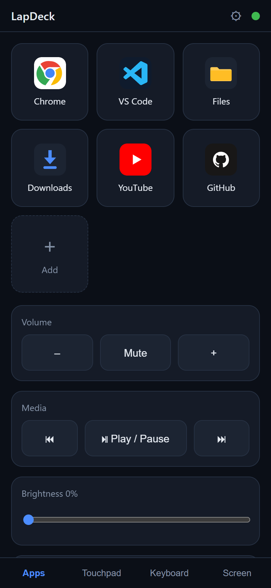
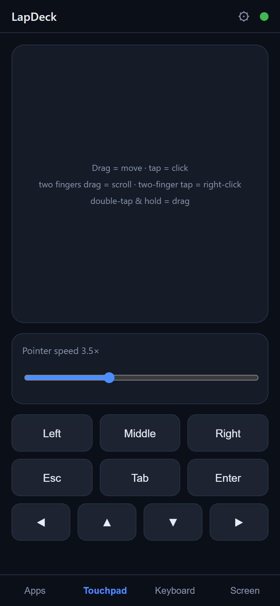
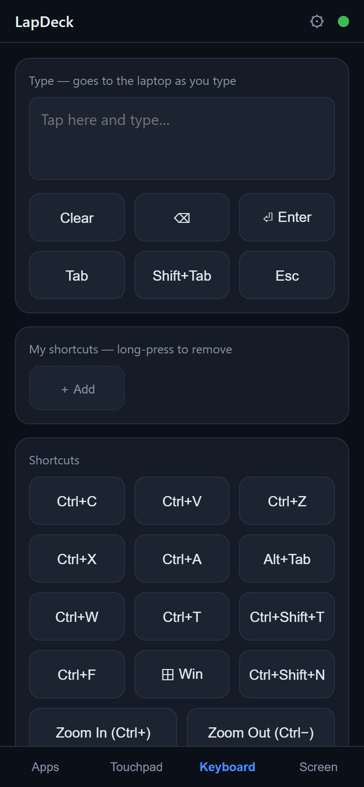
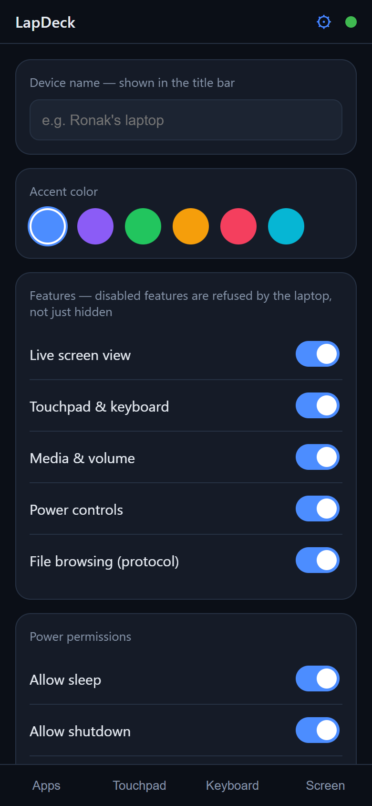

# LapDeck

[](LICENSE)
[](https://nodejs.org)
[](#faq)
[](CONTRIBUTING.md)

**Turn your phone into a remote deck for your Windows or Linux laptop.**

App launcher · touchpad · keyboard · live screen view · media & volume · brightness · lock/sleep/shutdown — all from the phone in your hand, over your own Wi-Fi. One Node.js process on the laptop, a PWA on the phone, zero cloud, zero accounts.

```
Phone (browser / installed PWA)  ── Wi-Fi / Tailscale ──►  LapDeck agent (Node.js on Windows / Linux)
```

Lying in bed and want to pause the movie, nudge the volume, or shut the laptop down? Presenting and need a remote touchpad? LapDeck is a single `npm start` away.

<p align="center">
  
  
  
  
</p>

## Features

- **App launcher** — tiles for apps, folders, files, and websites. Add/remove tiles from the phone; pick which browser opens a site.
- **Touchpad** — relative pointer with acceleration, tap-to-click, two-finger scroll, two-finger tap = right-click, double-tap-drag. Pointer speed slider.
- **Keyboard** — type live into the laptop (IME-safe diffing, so swipe-typing works), plus common shortcuts and **your own custom shortcut buttons** (any chord like `ctrl+shift+p`, or sequences like `ctrl+k,ctrl+o`).
- **Live screen view** — MJPEG stream with tap-to-click where you tap, a realtime client-predicted cursor overlay, a magnifier loupe, and quality presets.
- **Media & system** — play/pause/next/prev, volume, mute, brightness, battery readout.
- **Power** — lock, sleep, restart, shutdown, each with confirm + an abort window (grace period is configurable).
- **Settings screen** — everything below is tweakable from the phone itself.
- **PWA** — add to home screen and it feels like a native app.
- **Works from anywhere, not just home Wi-Fi** — optional: add [Tailscale](https://tailscale.com) (free) and control your laptop from the other side of the world, no port forwarding, no config. The agent detects it and shows a remote QR/URL automatically.

## Quick start

Requirements: Windows 10/11 **or** Linux, [Node.js ≥ 20](https://nodejs.org), phone on the same Wi-Fi.

```bash
git clone https://github.com/ronak-create/LapDeck.git
cd LapDeck
npm install
npm start
```

The terminal prints a QR code. Scan it with your phone — the UI opens already paired (the token rides in the link and is stored on the phone; you scan once). Then use your browser menu → **Add to Home screen**.

> **Phone can't connect?** On Windows, allow **Node.js** through Windows Firewall on **private networks** (the prompt appears on first run). On Linux, allow the port: `sudo ufw allow 8765/tcp`. That's the #1 cause.

### Linux requirements

Everything runs on both **X11** and **Wayland**, but the tools differ. The agent degrades gracefully — a missing tool disables just that feature with a clear message, it never crashes.

| Feature | Needs |
| --- | --- |
| Media / volume / mute | `pactl` (PulseAudio or PipeWire) + `playerctl` |
| Brightness | `brightnessctl` (or write access to `/sys/class/backlight`) |
| Power (lock/sleep/shutdown) | `systemd` + `loginctl` (standard on most distros) |
| Touchpad / keyboard — **X11** | `libXtst` (for the bundled nut.js) |
| Touchpad / keyboard — **Wayland** | `ydotool` + a running `ydotoold` with uinput access |
| Live screen view — **X11** | works out of the box (nut.js) |
| Live screen view — **Wayland** | `grim` (Sway/Hyprland); GNOME/KDE-Wayland portal-only sessions aren't supported yet |

Debian/Ubuntu one-liner for the common set:

```bash
sudo apt install libxtst6 pulseaudio-utils playerctl brightnessctl ydotool grim
```

**Wayland input setup:** `ydotool` injects via `/dev/uinput`, which needs the `ydotoold` daemon running and permission on the device. The simplest path is a udev rule granting your user access, then start the daemon (e.g. `systemctl --user enable --now ydotoold` if your distro ships the unit, or run `ydotoold` from your session autostart). See the [ydotool README](https://github.com/ReimuNotMoe/ydotool) for the udev rule.

### Run automatically at login (hidden, no console)

**Windows** — drops a tiny launcher into your Startup folder (no admin needed):

```powershell
powershell -ExecutionPolicy Bypass -File scripts\install-autostart.ps1
```

Manage it with `scripts\stop-agent.ps1` and `scripts\uninstall-autostart.ps1`.

**Linux** — installs a systemd `--user` service (no root):

```bash
bash scripts/install-autostart.sh
```

Manage it with `scripts/stop-agent.sh` and `scripts/uninstall-autostart.sh`. To keep it running after you log out, enable lingering once: `sudo loginctl enable-linger "$USER"`.

Autostart runs after you log in, because input injection and screen capture need your interactive graphical session.

## Customization

Open the **⚙ Settings** screen on the phone (or edit `data/settings.json` on the laptop — see [docs/CONFIGURATION.md](docs/CONFIGURATION.md) for every key):

| Setting | What it does |
| --- | --- |
| Device name | Title shown in the app |
| Accent color | Theme, synced to every paired phone |
| Feature switches | Turn screen view / input / media / power / file browsing off entirely — **enforced by the agent**, not just hidden |
| Power permissions | Allow/deny sleep, shutdown, restart individually; shutdown grace period (0–60 s) |
| Custom shortcuts | Your own buttons on the Keyboard screen |
| Stream presets | fps / width / JPEG quality of the Low/Med/High screen presets (file only) |
| Port / bind address | `settings.json` or `LC_PORT` / `LC_BIND` env vars |
| Per-phone prefs | Haptics, natural scrolling, pointer speed (stored on the phone) |

## Security model

- Pairing is a random 256-bit token, generated on first run and embedded in the QR link. **Every command requires it** — over WebSocket (first message must authenticate, 3 s or the socket drops) and on the MJPEG stream. Token comparison is constant-time.
- Destructive actions (sleep/shutdown/restart) additionally require a `confirm` flag, must be enabled in settings, and shutdown/restart honor a grace period during which one tap aborts.
- Feature switches are enforced server-side: a disabled feature's commands are refused even if a client sends them.
- To re-pair from scratch (rotate the token), delete `data/secret.json` and restart.
- Transport is plain HTTP/WS on your LAN. That's fine for a home network you trust; for anything else use Tailscale, which encrypts end-to-end (WireGuard) and gives you a valid-HTTPS URL via MagicDNS. **Never port-forward the agent to the open internet.**

## Use it from anywhere (remote access)

Out of the box LapDeck works on your local network — phone and laptop on the same Wi-Fi, nothing leaves your house.

Want to control the laptop from work, a friend's place, or another country? Install [Tailscale](https://tailscale.com/download) (free for personal use) on the laptop and phone with the same account. That's the entire setup — no port forwarding, no dynamic DNS, no server to rent. Tailscale puts both devices on a private WireGuard-encrypted network, and LapDeck detects it automatically: the agent prints a second "remote" QR, and the UI's *Remote access* panel offers a one-tap switch plus an HTTPS URL (via MagicDNS/`tailscale cert`) that makes the PWA installable as a real app from anywhere.

Tailscale is entirely optional — LapDeck never needs the internet and has no cloud component. Any WireGuard/VPN setup that puts your phone on your home network works too; Tailscale is just the zero-config way. What you should **not** do is expose the agent's port directly to the internet — see the security model above.

## Project layout

```
src/
  index.js        HTTP + WebSocket server, QR pairing
  platform.js     OS + display-server (X11/Wayland) detection
  settings.js     defaults + data/settings.json (the customization layer)
  config.js       pairing token, launcher entries
  auth.js         constant-time token guards
  router.js       command dispatch + feature-switch enforcement
  stream.js       shared MJPEG capture loop (viewer fan-out + backpressure)
  handlers/       one module per command namespace (apps, input, media, …)
  os/             per-capability facade: picks the backend for this platform
  win/            Windows backends (PowerShell/CLI helpers)
  linux/          Linux backends (pactl, brightnessctl, systemctl, ydotool, grim…)
  backends/       shared nut.js input + screen backends (Windows & Linux X11)
public/           the phone PWA (vanilla HTML/CSS/JS)
scripts/          autostart install/stop/uninstall (PowerShell + shell)
data/             created at runtime: token, settings, launcher (gitignored)
```

The full WebSocket protocol is documented in [docs/PROTOCOL.md](docs/PROTOCOL.md) — it's deliberately simple JSON envelopes, so alternative clients (a native Android app, a CLI, an automation script) are easy to build.

## FAQ

**Windows and Linux?** Yes. All OS glue sits behind a small facade (`src/os/`) that selects a per-platform backend: `src/win/` on Windows, `src/linux/` on Linux, with shared nut.js backends (`src/backends/`) for X11 and Windows. A macOS port would add `src/mac/` and slot into the same facade — contributions welcome.

**Wayland vs X11?** Both work. On X11 everything runs through nut.js just like Windows. On Wayland the compositor blocks synthetic input and screen grabs, so LapDeck uses `ydotool` (input) and `grim` (screen) instead — see [Linux requirements](#linux-requirements). Two known Wayland gaps: two-finger **scroll** isn't available via ydotool, and screen view needs a `grim`-capable compositor (Sway/Hyprland).

**Sleep hibernates instead?** Windows quirk: if hibernation is enabled, `SetSuspendState` hibernates. `powercfg /h off` if you prefer S3 sleep. On Linux, sleep uses `systemctl suspend`.

**Screen view shows the primary display only** — multi-monitor selection is on the wishlist.

**Can I see my laptop screen on the phone?** Yes — the **Screen** tab is a live view of the laptop (launcher tiles _open apps on the laptop_; the Screen tab is what mirrors it back to the phone, tap-to-click included). On iPhone/iPad it works too: iOS Safari can't render the MJPEG stream, so LapDeck automatically falls back to fetching frames one at a time — same picture, just polled instead of streamed.

**Does it work without internet?** Yes — everything is LAN-local. Internet is only involved if you use Tailscale.

## Contributing

Issues and PRs welcome — see [CONTRIBUTING.md](CONTRIBUTING.md). Keep it dependency-light: plain modern JavaScript (ESM, Node ≥ 20), no TypeScript, no build step.

Found a security problem? Please report it privately — see [SECURITY.md](SECURITY.md).

## License

[MIT](LICENSE) © Ronak Parmar
